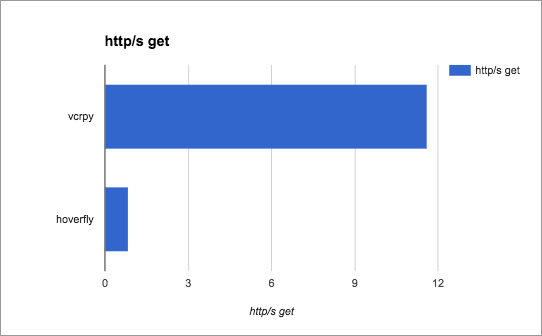

Speeding up scikit-learn workflow using a high-performance Go proxy.
====================================================================

.. raw:: html
  
    

.. toctree::
   :maxdepth: 2

Up until now I've been using vcrpy to cache my requests during the data mining phase of my scikit-learn work, but I was recently intimated to an ultra-high-performance GoLang caching proxy, and wanted to see if I could use it for more speed-ups. I was so impressed that I wrote a python wrapper for it.

.. code-block:: bash
  
    pip install hoverpy --user --upgrade

Offlining readthedocs:

.. code-block:: python

    import time
    import hoverpy
    import requests

    rtd = "http://readthedocs.org/api/v1/project/?limit=50&offset=0&format=json"

    with hoverpy.HoverPy(recordMode='once'):
        start = time.time()
        objects = requests.get(rtd).json()['objects']
        links = ["http://readthedocs.org" + x['resource_uri'] for x in objects]
        for link in links:
            response = requests.get(link)
            print("url: %s, status code: %s" % (link, response.status_code))
        print("Time taken: %f" % (time.time() - start))

Ouput:

.. code-block:: bash
    
    [...]
    Time taken: 9.418862

Upon second invocation:

.. code-block:: bash
    
    [...]
    Time taken: 0.093463

That's much better: *100.78x* faster than hitting the real endpoint.

.. figure:: http_diff.png

Not surprising really. My issue with caching proxies however, is that it's the https handshaking that takes time–not fetching the data–and one of my many annoyances with vcrpy is that it won't let me remap https requests to http.

Therefore I was very pleased to see remapping work perfectly in hoverpy (code provided below the next graph), with hoverpy wiping the floor with vcrpy; over 13x faster:

.. literalinclude:: ../../examples/hn.py
   :language: python

Once again, on second run, hoverfly steps in with a very significant speedup. I'm very impressed with hoverfly's performance.

Data mining HN
--------------

Before we start, please note you can find the final script `here <https://raw.githubusercontent.com/shyal/hoverpy-scikitlearn/master/hoverpy_scikitlearn.py>`_. You'll also need the `data <https://github.com/shyal/hoverpy-scikitlearn/raw/master/data.tar>`_.

What I also really like about Hoverfly is how fast it loads, and how fast it loads up the boltdb database. I also like the fact it's configuration-free. Here's a function you can use to offline titles for various HN sections:

.. literalinclude:: ../../hoverpy_scikitlearn.py
   :language: python
   :lines: 1-28

------------

Data mining Reddit
-------------------

While we're at it, let's put a function here for offlining subreddits. This one also includes comments:

.. literalinclude:: ../../hoverpy_scikitlearn.py
    :language: python
    :lines: 29-48

Organising our datamines
------------------------

Rather than sitting around hitting these endpoints, you may as well download these datasets, to save yourself the time.

.. code-block:: bash

    wget https://github.com/shyal/hoverpy-scikitlearn/raw/master/data.tar
    tar xvf data.tar

And the code:

.. literalinclude:: ../../hoverpy_scikitlearn.py
   :language: python
   :lines: 50-71

Calling ``doMining()`` caches everything, which takes a while. Although you've hopefully downloaded and extracted ``data.tar``, in which case it shouldn't take more than a few seconds. That's all our data mining done. I think this is a good time to remind ourselves a big part of machine learning is, in fact, data sanitisation and mining.

.. code::

        GETTING HACKERNEWS showstories DATA
        got 54 hackernews titles in 0.099983 seconds
        GETTING HACKERNEWS askstories DATA
        got 92 hackernews titles in 0.160661 seconds
        GETTING HACKERNEWS jobstories DATA
        got 12 hackernews titles in 0.024908 seconds
        GETTING REDDIT r/republican DATA
        GETTING REDDIT r/democrat DATA
        GETTING REDDIT r/linux DATA
        GETTING REDDIT r/python DATA
        GETTING REDDIT r/music DATA
        GETTING REDDIT r/movies DATA
        GETTING REDDIT r/literature DATA
        GETTING REDDIT r/books DATA

        real    0m9.425s

-----------------------------------

Building an HN or Reddit classifier
-----------------------------------

.. .. raw:: html
    
    

OK time to play. Let's build a naive bayesian text classifier. You'll be able to type in some text, and it'll tell you which subreddit it thinks the text could have originated from.

For this part, you'll need scikit-learn.

.. code-block:: bash

    pip install numpy

    pip install scikit-learn

Running the classifier:

.. literalinclude:: ../../hoverpy_scikitlearn.py
   :language: python
   :lines: 73-119

In case you are not familiar with tokenizing, tfidf, classification etc. then I've provided a link at the end of this tutorial that'll demistify the block above.

-----------------------------------

Wrapping things up
------------------

You can find hoverpy's and hoverfly's extensive documentation `here <http://hoverpy.io>`_ and `here <http://hoverfly.io>`_. This excellent and lightweight proxy was developed by the very smart guys at `SpectoLabs <http://specto.io>`_ so I strongly suggest you show them some love (I could not, however, find a donations link).

Repository for this post, with code: https://github.com/shyal/hoverpy-scikitlearn

http://scikit-learn.org/stable/tutorial/text_analytics/working_with_text_data.html

Taking it one step further
--------------------------

The premise of hoverfly is, in fact, testing, CD and CI. The intent is to commit your requests database, and test against them. This makes your code completely hermetic to external dependencies.

.. image:: https://travis-ci.org/shyal/hoverpy-scikitlearn.svg?branch=master
    :target: https://travis-ci.org/shyal/hoverpy-scikitlearn

.. raw:: html

    

    
    <noscript>Please enable JavaScript to view the <a href="https://disqus.com/?ref_noscript">comments powered by Disqus.</a></noscript>

