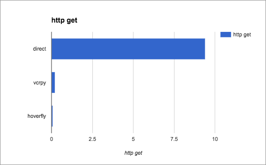

Speeding up scikit-learn workflow using a high-performance Go proxy.
====================================================================

.. toctree::
   :maxdepth: 2

I recently came across an ultra-high-performance GoLang caching proxy, and wanted to see if I could use it to speed-up my scikit-learn based work. Up until now I've been using vcrpy to cache my requests during the mining phase, so I wanted to do a speed comp.

.. code-block:: bash
  
    pip install hoverpy --user

Example:

.. code-block:: python

    import time
    import hoverpy
    import requests

    start = time.time()

    rtd = "http://readthedocs.org/api/v1/project/?limit=50&offset=0&format=json"

    with hoverpy.HoverPy(recordMode='once'):
        objects = requests.get(rtd).json()['objects']
        links = ["http://readthedocs.org" + x['resource_uri'] for x in objects]
        for link in links:
            response = requests.get(link)
            print("url: %s, status code: %s" % (link, response.status_code))
        print("Time taken: %f" % (time.time() - start))

Ouput:

.. code-block:: bash
    
    [...]
    Time taken: 9.418862

However upon second invocation:

.. code-block:: bash
    
    [...]
    Time taken: 0.093463

That's much better: *100.78x* faster than hitting the real endpoint.

Not that surprising really. My issue with caching proxies these days, is that it's the https handshaking that takes time, not fetching the data. One of my annoyances with vcrpy is that it won't remap my https requests to http. However this worked perfectly in hoverpy.

.. figure:: https_get.png

Over 13x faster than vcrpy.

Data mining HackerNews and Reddit
---------------------------------

What I really, really like about Hoverfly, is that it loads so fast in the background. Working with it feels completely transparent, requires zero configuration, and as you'll see I can include its data in my repos; pull that data in for my main functionality, and for my unit testing too. This makes my work 100% water-tight, blazingly fast, and **utterly failure proof**.

.. ./lib/hnMiner.py
   ~~~~~~~~~~~~~~~~

.. literalinclude:: ../../lib/hnMiner.py
   :language: python

Output:

.. code-block:: bash

    got 100 hackernews titles in 14.678717 seconds

You may notice a bolt database was created inside the ``./data`` directory:

.. code-block:: bash

    ll data/hn.topstories.db
    -rw-------  1 ioloop  staff  262144 Dec 13 15:27 data/hn.topstories.db

Let's run the same command again:

.. code-block:: bash

    python lib/hnMiner.py

Output:

.. code-block:: bash

    got 100 hackernews titles in 0.180554 seconds

This is roughly an **80x speedup**, *hitting our endpoint is starting to feel more like hitting a database* which is probably the key point to this chapter.

------------

Putting our miners together
---------------------------

Let's go ahead and write a ``doMining`` function that'll bring in all the data we need from the HN sections, and Reddit subs. You'll need to run this file directly, as it's in the ``./lib`` folder, unless you want to sit around while all the data re-downloads (you don't).

.. literalinclude:: ../../lib/dataMiner.py
   :language: python

command:

.. code-block:: bash

    python lib/dataMiner.py

That's really all we need, and thanks to HoverFly the entire process, once cached, is blazingly fast. Let's move on to our next step.

Building an HN or Reddit classifier
-----------------------------------

Well now that we can transparently cache our dependencies, let's build something interesting. We are going to build a classifier that predicts whether text may have come from HN or Reddit, and also specifically which sub.

.. code-block:: bash

    $ python social_media.py

This spins up our classifier:

.. raw:: html
    
    

This is our whole classifier, and application entry point, ``./social_media.py``:

.. literalinclude:: ../../social_media.py
   :language: python

Let's break it down a little.

Scikit-learn has a high level component ``CountVectorizer`` that takes care of text preprocessing, tokenizing and filtering of stopwords for us. It transforms our text into feature vectors, in the form of a dictionary:

.. literalinclude:: ../../social_media.py
   :language: python
   :lines: 9-10

You can check the score for various tokens, i.e.

.. code-block:: python

    count_vect.vocabulary_.get(u"python")

The word python appears a total of 21567 in this corpus.

We need to build a tf–idf (term frequency times inverse document frequency) transformer.

.. literalinclude:: ../../social_media.py
   :language: python
   :lines: 12-13

This is to prevent larger documents to score higher, by having occurances score higher due to document size instead of token term relevance, which is why the fix is to divide the term frequencies by the document size.

.. literalinclude:: ../../social_media.py
   :language: python
   :lines: 34-39

And finally our ``predict`` function, which takes an array of sentences.

.. literalinclude:: ../../social_media.py
   :language: python
   :lines: 18-25

-----------------------------------

Taking it one step further with testing
---------------------------------------

At this point I'm hoping you see how water tight this code is. But one is never above unit testing. What is great is that, at this point, since we have zero external data dependencies, the chances of the tests failing are virtually none.

.. literalinclude:: ../../test_social_media.py

In fact we can be so confident about our tests using HoverFly, that we can rest assured if our tests fail, or if we have issues then it will only have to do with our environment, or software dependencies; but not our data dependencies.

.. image:: https://travis-ci.org/shyal/hoverpy-scikitlearn.svg?branch=master
    :target: https://travis-ci.org/shyal/hoverpy-scikitlearn
